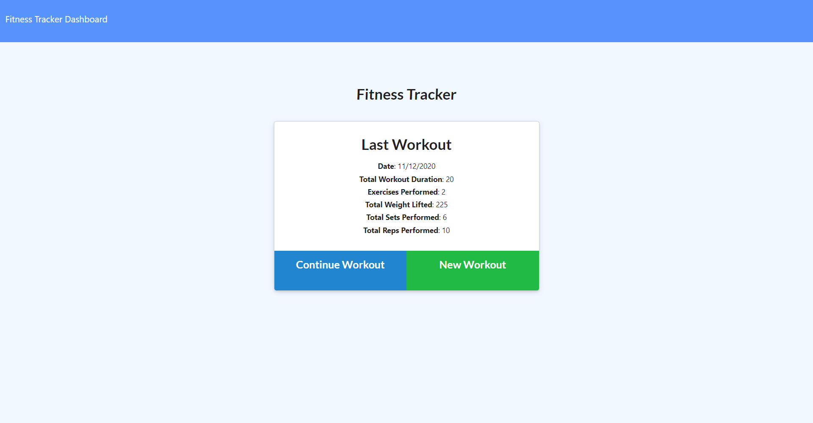
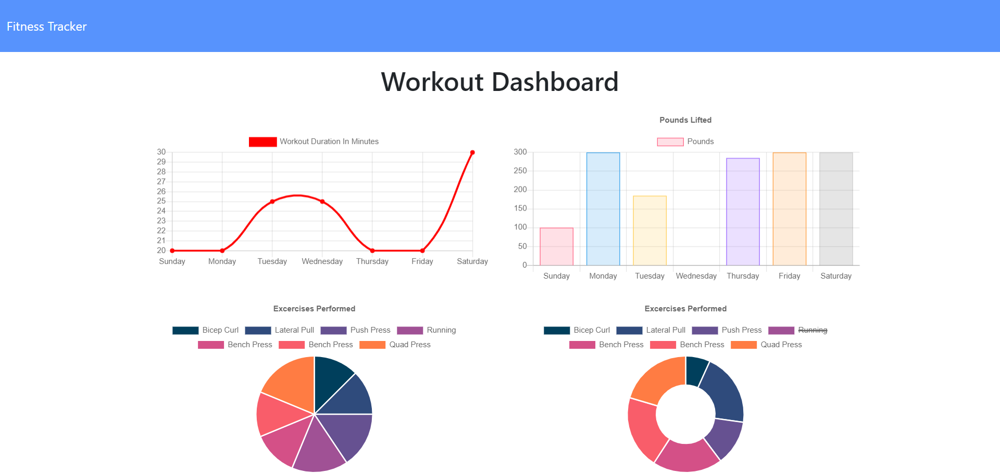

# Workout Tracker

# Application Does:
* This is an application for tracking exercises. It can save both cardio and resistance type of workouts.

# Technologies used:
* HTML, CSS, JavaScript, express.js, node.js
* Front-end : HTML, CSS, BOOTSTRAP
* Back-end :Javascript, Express.js, Node.js, ES6, MongoDB, Mongoose(JS library),chart(JS library), Morgan(middleware)
* Deployed in Heroku
* MongoDB Atlas()  [Cloud Database] 

# Features:
* Add exercises to new workout plan
* Add exercises to previos workout plan
* shows the workout duration using line chart
* shows the pounds lifted using bar chart
* shows the exercises performed using pie chart 
* shows the last exercise results
* shows the results of all exercises of same id

# Sample web pages
 
&nbsp;
 

# Github repository
 https://github.com/vsatyakavya/WorkoutTracker      

 
 
# heroku link
https://boiling-stream-90218.herokuapp.com/

# contact Information
satyakavya24@gmail.com

@copyright 2020
